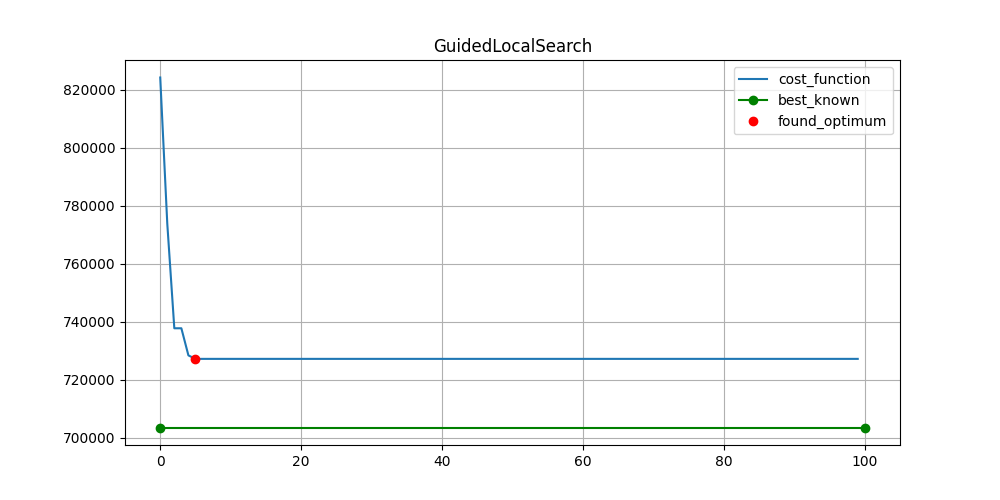
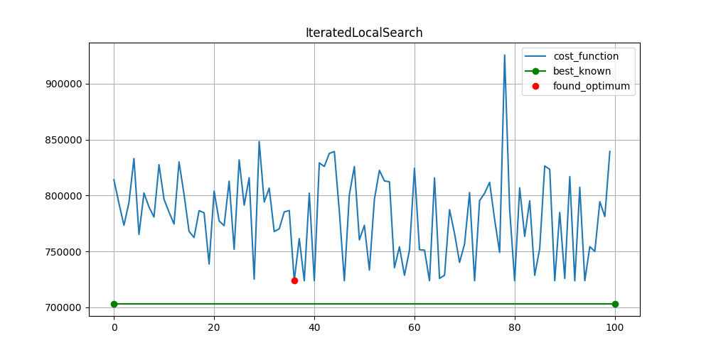
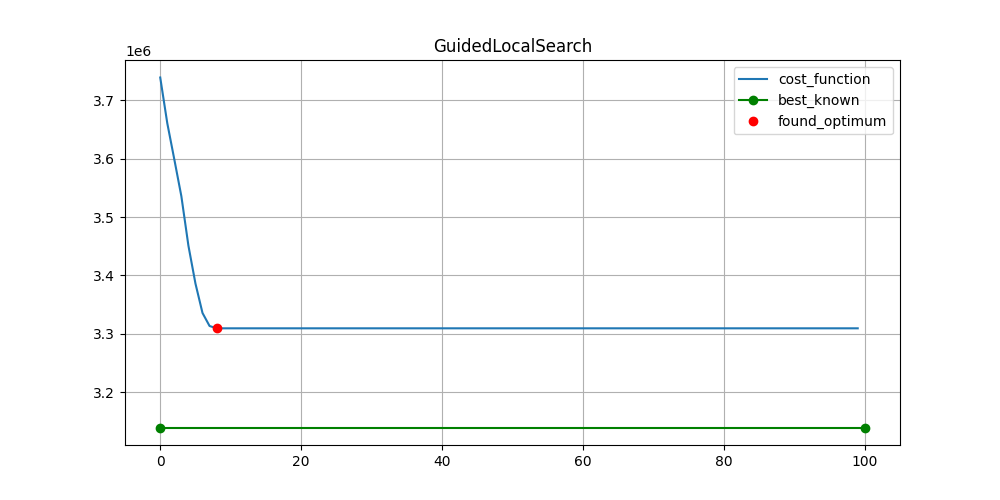
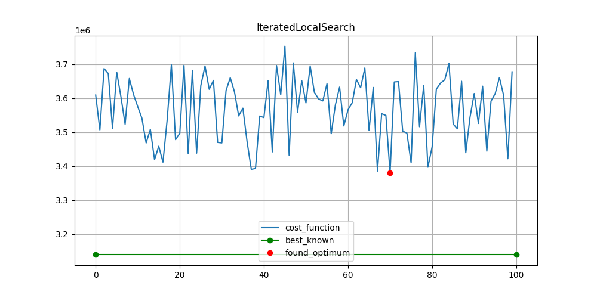
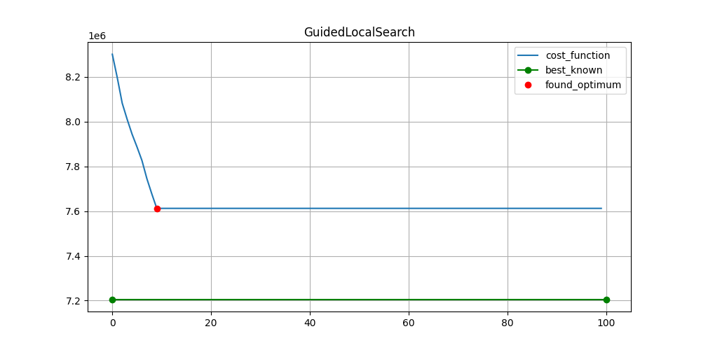
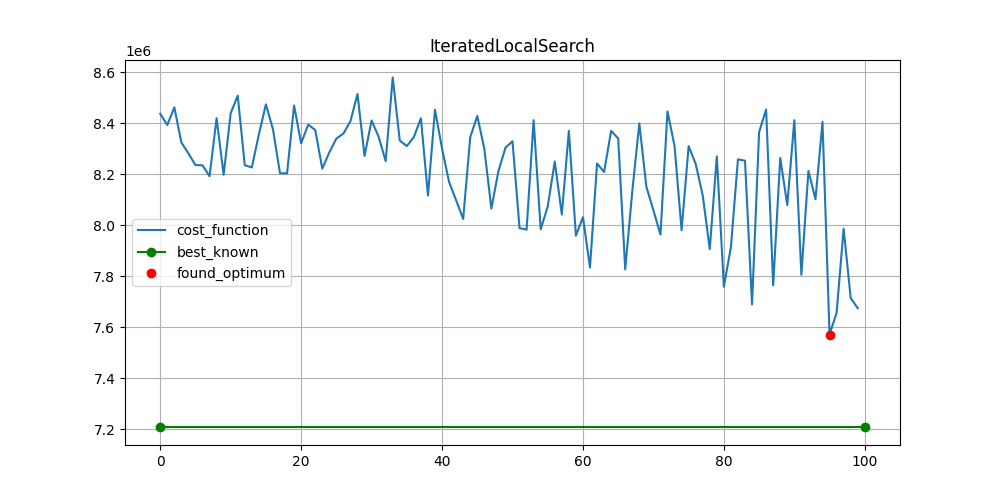
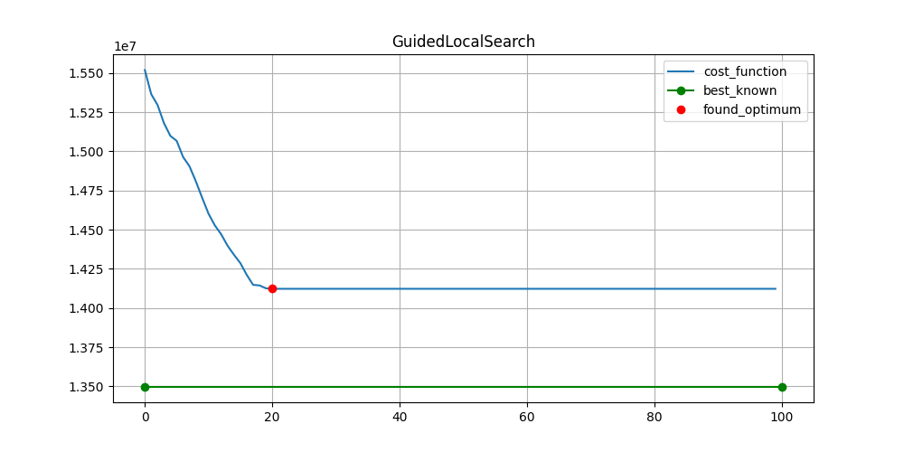
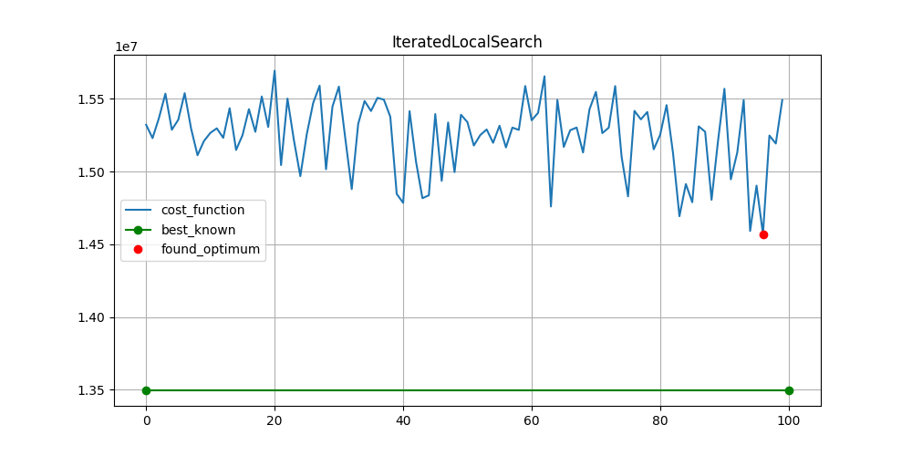
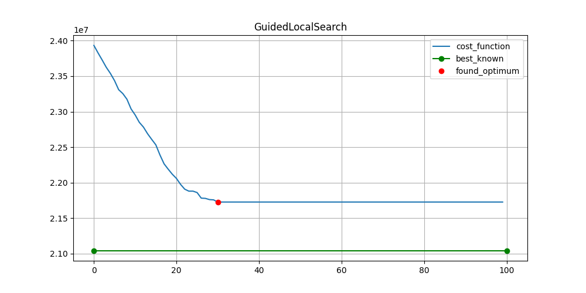
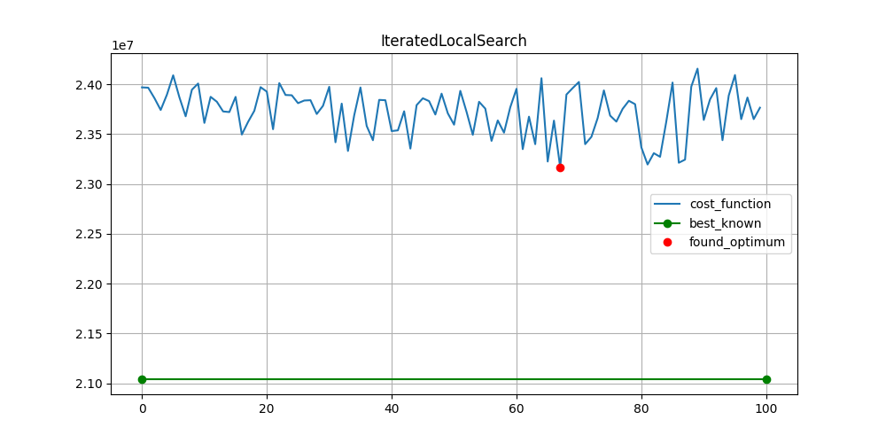

# Lab №3. Quadratic Assignment Problem

**Замечание:** Время указано в секундах. Ответы можно найти [здесь](https://drive.google.com/file/d/1Dt28VJtY_CZEI3S_lqql0scBNOSbj22n/view?usp=sharing) или в соответствующих папках в этом репозитории.
## Results for *`tai20a`*
|File name|Method             |Best known|Result    |Time    |
|---------|-------------------|----------|----------|--------|
|tai20a   |LocalSearch        |703482    |758664.0  |0.0735  |
|tai20a   |IteratedLocalSearch|703482    |723820.0  |1.8226  |
|tai20a   |GuidedLocalSearch  |703482    |727164.0  |2.4299  |

Guided Search            |  Iterated Search
:-------------------------:|:-------------------------:
  |  

## Results for *`tai40a`*
|File name|Method             |Best known|Result    |Time    |
|---------|-------------------|----------|----------|--------|
|tai40a   |LocalSearch        |3139370   |3352434.0 |0.6194  |
|tai40a   |IteratedLocalSearch|3139370   |3380908.0 |4.2808  |
|tai40a   |GuidedLocalSearch  |3139370   |3309324.0 |18.6779 |

Guided Search            |  Iterated Search
:-------------------------:|:-------------------------:
  |  

## Results for *`tai60a`*
|File name|Method             |Best known|Result    |Time    |
|---------|-------------------|----------|----------|--------|
|tai60a   |LocalSearch        |7205962   |7686368.0 |1.7136  |
|tai60a   |IteratedLocalSearch|7205962   |7570856.0 |7.6193  |
|tai60a   |GuidedLocalSearch  |7205962   |7612428.0 |61.79   |

Guided Search            |  Iterated Search
:-------------------------:|:-------------------------:
  |  

## Results for *`tai80a`*
|File name|Method             |Best known|Result    |Time    |
|---------|-------------------|----------|----------|--------|
|tai80a   |LocalSearch        |13499184  |14683506.0|1.2035  |
|tai80a   |IteratedLocalSearch|13499184  |14570728.0|8.9962  |
|tai80a   |GuidedLocalSearch  |13499184  |14122540.0|136.2425|

Guided Search            |  Iterated Search
:-------------------------:|:-------------------------:
  |  

## Results for *`tai100a`*
|File name|Method             |Best known|Result    |Time    |
|---------|-------------------|----------|----------|--------|
|tai100a  |LocalSearch        |21044752  |22948292.0|0.999   |
|tai100a  |IteratedLocalSearch|21044752  |23165426.0|9.6282  |
|tai100a  |GuidedLocalSearch  |21044752  |21727642.0|251.058 |

Guided Search            |  Iterated Search
:-------------------------:|:-------------------------:
  |  

## Team Members
- *[Alexander Slavutin](https://github.com/AlexanderSlav)* 
- *[Pavel Semkin](https://github.com/PVSemk)*

Copyright (C) 2020-2021, Bolik&Lolik Inc. , all rights reserved.